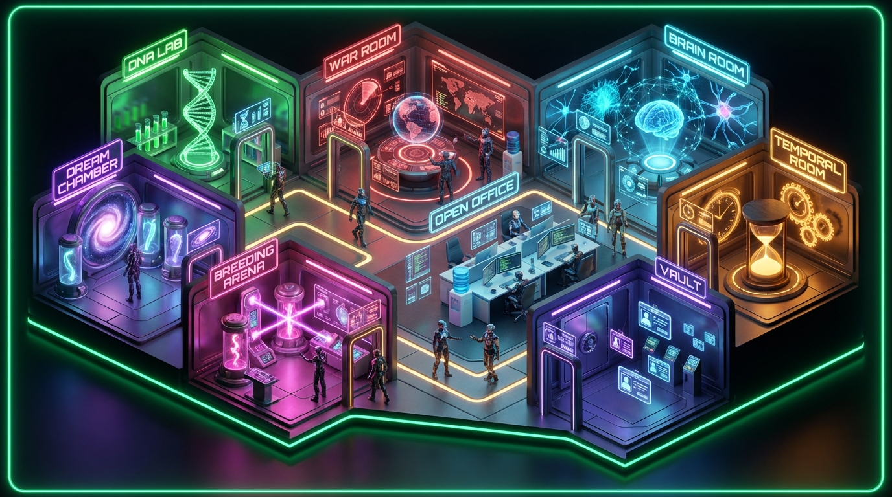

# Anima-3D - PepeClaw Office Viewer

Anima-3D turns an AI agent workspace into a live 3D office: rooms, agents, activity, status, and navigation in one visual surface. It is built to answer the question logs cannot answer quickly: what is the agent doing right now?

The current launch focus is the browser demo. The viewer runs with built-in demo data, and when OpenClaw is running the bridge auto-loads live sessions so you can watch real agents working in the office.

<p align="center">
  
  <br><em>Replace this with the final browser screenshot once the viewer polish pass lands.</em>
</p>

## Demo Story

PepeClaw is a model-agnostic runtime visibility layer. It does not try to replace a base model; it gives agent systems a place to be seen, inspected, and explained.

The office viewer is the first proof point:

- A full-screen 3D/isometric office for AI agents.
- Eight task rooms that map abstract agent work to visible spaces.
- Agent status, room navigation, minimap, activity feed, and detail panels.
- Demo-mode fallback data for instant sharing.
- Optional OpenClaw gateway data when connected.

The sharp public message:

> AI agents should not be invisible background processes. PepeClaw gives them a workspace you can watch.

## Run The Demo

```bash
npm install
npm run live
```

Open `http://localhost:5173`.

For a production-style local run with the same live bridge, use:

```bash
npm run preview:live
```

Then open `http://127.0.0.1:4173`.

The app works without configuration. For live OpenClaw data, start your gateway and keep the bridge pointed at:

```bash
VITE_GATEWAY_URL=http://localhost:3033
```

If you need to override the gateway manually, the in-app connection guide defaults to `http://localhost:3033`.

## Demo Flow

Use this sequence for screenshots, video capture, or a live walkthrough:

1. Open the app on `http://localhost:5173` and wait for the office to settle.
2. Start in overview so the full office layout is visible.
3. Pan/zoom lightly to show that this is an interactive viewer, not a static dashboard.
4. Click a high-signal room such as Genome Lab, War Room, Meta-Learning, or Breeding Arena.
5. Click an agent to show selection and agent context.
6. Point out the activity feed and minimap as the operational layer.
7. Return to overview with `Escape` or the overview navigation.
8. Capture the final screenshot only after the current viewer polish branch lands.

## The 8 Rooms

| Room | Public framing |
| --- | --- |
| Genome Lab | Skills, capabilities, and evolution as a visible workspace. |
| Dream Chamber | Creative exploration, memory, and offline synthesis. |
| War Room | Project health, risks, velocity, and operational focus. |
| Red Team Arena | Adversarial review and assumption testing. |
| Meta-Learning Center | Capability tracking and self-improvement signals. |
| Temporal Engine | Scheduling, batching, and time-aware work. |
| Identity Vault | Agent identity, provenance, and verification. |
| Breeding Arena | Combining agent capabilities into new variants. |

## What To Show

- **The office first**: lead with the visual workspace, not the implementation.
- **Agents have location**: each agent appears in a room tied to current work.
- **The UI explains motion**: activity feed, minimap, status, and panels make the scene readable.
- **It runs immediately**: demo data means reviewers can clone, run, and understand it.
- **Live data is optional**: OpenClaw integration is a connection point, not a setup blocker.

## Controls

| Action | Control |
| --- | --- |
| Pan office | Drag |
| Zoom | Mouse wheel / trackpad scroll |
| Select room | Click a room or use room navigation |
| Select agent | Click an agent |
| Return / clear focus | `Escape` |
| Toggle overview | `Space` |
| Move between rooms | Arrow keys |

## Tech Stack

- React 19 + TypeScript
- Phaser 3 office viewer
- Vite development/build pipeline
- Framer Motion UI transitions
- Tailwind CSS styling
- Vitest test suite
- Optional OpenClaw gateway bridge

## Verification

Known project baseline from the 2026-04-10 worklist:

- Build passes.
- Tests pass: 93/93.
- Remaining launch work is visual browser verification, screenshot capture, and public packaging.

Before public launch, run:

```bash
npm run build
npm run test
```

Then browser-verify `http://localhost:5173` and capture fresh assets.

## Architecture

```text
src/
├── api/
│   ├── gateway.ts              # Gateway client with timeout/fallback behavior
│   └── DataProvider.tsx         # Live data or built-in demo data
├── components/
│   ├── ThreeScene.tsx           # Current scene wrapper used by App
│   ├── PhaserScene.tsx          # Phaser scene wrapper
│   ├── ActivityFeed.tsx         # Operational event stream
│   ├── MiniMap.tsx              # Office overview navigation
│   └── ConnectionGuide.tsx      # Gateway setup guidance
├── phaser/
│   ├── OfficeScene.ts           # Office layout, camera, rooms, agents
│   ├── AgentSprite.ts           # Agent rendering/animation
│   └── IsoHelper.ts             # Isometric layout helpers
├── rooms/                       # Detail panels for major rooms
├── data/                        # Shared types and demo data
└── App.tsx                      # React shell, routing state, HUD

server/bridge.js                 # Optional local gateway bridge
tests/                           # Vitest coverage
skills/                          # PepeClaw/OpenClaw skill docs
```

## Launch Assets Needed

- `docs/screenshots/hero.jpg`: final polished overview screenshot.
- `docs/screenshots/room-focus.jpg`: one room/agent close-up.
- `docs/demo/DEMO_SCRIPT.md`: live walkthrough and public launch checklist.
- Optional: 20-30 second screen recording for README/social posts.

## Contributing

See [CONTRIBUTING.md](CONTRIBUTING.md).

## License

[MIT](LICENSE)
