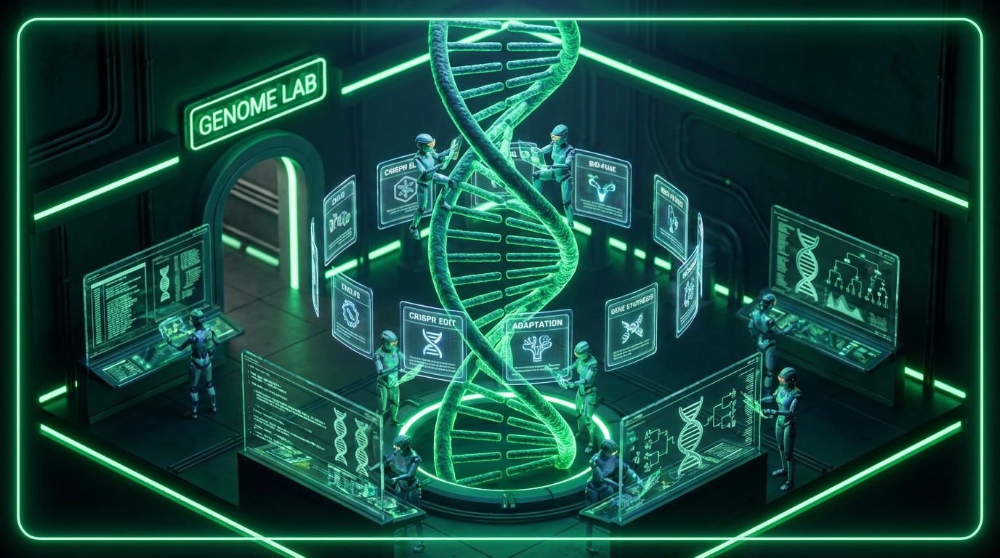
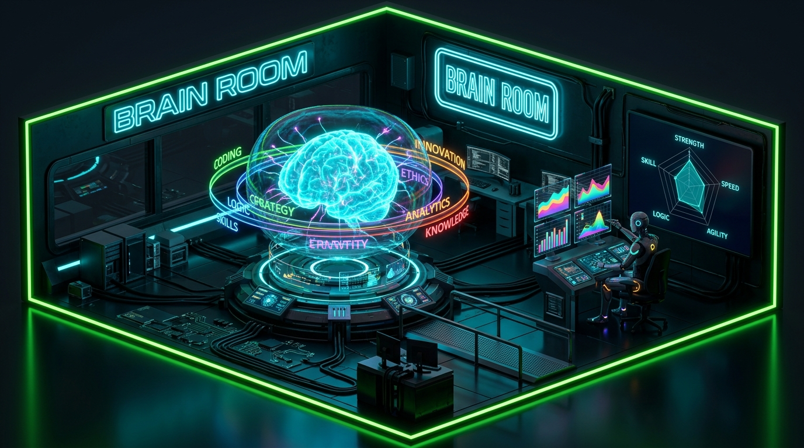
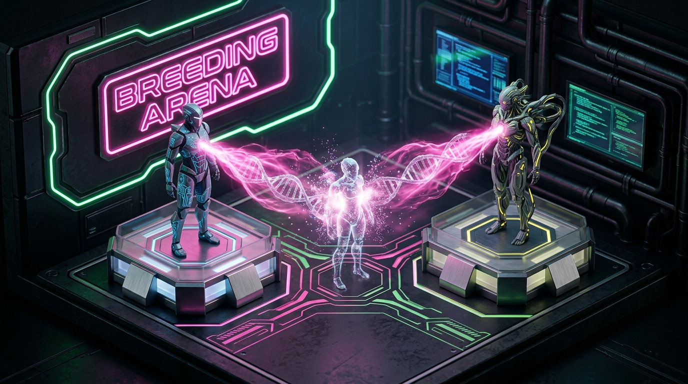

<p align="center">
  
</p>

<h1 align="center">🐸 PepeClaw</h1>

<h3 align="center"><em>Self-Evolving AI Agents You Can See.</em></h3>

<p align="center">
  The first 3D visualization layer for autonomous AI agents.<br>
  Watch your agents evolve, breed, dream, and learn — in real-time, in your browser.<br>
  <strong>Give your agent a soul.</strong>
</p>

<p align="center">
  
  
  
  
  
  
  
</p>

<p align="center">
  <a href="#install-in-10-seconds">Install</a> •
  <a href="#the-8-rooms">Rooms</a> •
  <a href="#self-evolving-skills">Skills</a> •
  <a href="#screenshots">Screenshots</a> •
  <a href="#architecture">Architecture</a> •
  <a href="CONTRIBUTING.md">Contributing</a>
</p>

---

**Your AI agent runs 24/7. But what is it actually doing?**

PepeClaw gives you eyes. Eight immersive 3D rooms where you watch your agents work, learn, debate, dream, and evolve — with real-time data from your [OpenClaw](https://github.com/openclaw) instance. No more staring at logs. No more guessing if your agent is improving.

**See it. Understand it. Trust it.**

---

## ✨ What Makes This Different

| Feature | Traditional Agent Tools | The Most Advanced Self-Evolving Systems | PepeClaw |
|---------|----------------------|----------------------------------------|----------|
| Agent visibility | Text logs | Dashboard | **3D animated agents** in 8 immersive rooms |
| Self-improvement | Manual prompt tuning | Nightly cron jobs | **19 autonomous skills** — evolve in real-time AND every 6 hours |
| Skill creation | Manual only | Background generation | **Real-time mid-conversation** skill drafting + user approval |
| Skill repair | Re-deploy | Post-hoc rewrite | **Live mutation** — fixes skills the instant they fail |
| Prompt evolution | DSPy/GEPA (heavy deps) | External ML frameworks | **Zero-dependency genetic evolution** — native bash + agent reasoning |
| User understanding | Flat facts file | Hosted API (Honcho) | **6-dimension dialectic model** — local, private, incremental |
| Agent breeding | Doesn't exist | Doesn't exist | **Combine agent genomes** to create hybrid offspring |
| Emotional awareness | None | None | **Emotion engine** with visible auras |
| Agent identity | Config file | Config file | **On-chain DNA** via Block Genomics |

---

## Install in 10 Seconds

```bash
# One-liner (detects your OpenClaw automatically)
curl -fsSL https://raw.githubusercontent.com/BitmapAsset/pepeclaw/main/install.sh | bash
```

Or manually:

```bash
git clone https://github.com/BitmapAsset/pepeclaw.git
cd pepeclaw
npm install
npm run dev
# Open http://localhost:5173 — works immediately with mock data
```

Or just tell your OpenClaw: **"Install PepeClaw"** — it handles everything.

---

## The 8 Rooms

### 🧬 Genome Lab


Watch skills mutate, evolve, and compete. A rotating 3D DNA helix with orbiting skill cards shows your agent's capability genome in real-time. See fitness scores rise as skills improve across generations.

### 💭 Dream Chamber
Your agent's creative subconscious, visualized. A starfield with aurora shaders and connected dream nodes floating in 3D space. The Memory Palace lets you walk through your agent's memories as explorable rooms.

### ⚔️ War Room
Project health at a glance. 3D radar with health gauges, velocity charts, and dependency maps. Your agent triages projects, flags risks, and tracks momentum — all visible as living data.

### 🔴 Red Team Arena
Watch your agent debate itself. Two AI agents face off on opposing podiums with argument energy beams, bias detection panels, and an assumption challenge board. Your agent's ideas get stress-tested in real-time.

### 🧠 Meta-Learning Center


A 3D brain with neural pathways lighting up as your agent learns. Capability rings orbit around it. See accuracy, response time, and task completion improve over time. Self-modification proposals appear in a kanban board.

### ⏳ Temporal Engine
A 3D hourglass with animated sand and a flowing timeline river. Your agent optimizes task scheduling, detects batch opportunities, and flags procrastination patterns. Time becomes visible.

### 🔐 Identity Vault
Agent identity, verified on Bitcoin. A vault door with rotating gear mechanism and floating identity cards. Integrates with Block Genomics for sovereign, on-chain agent DNA. Your agent's lineage is provable.

### 🧪 Breeding Arena


**The showstopper.** Combine two agents' skill genomes to create hybrid offspring. DNA helixes intertwine with particle cascades, neural pathways form between parents, and a child agent materializes with inherited capabilities. Breed → mint → verify on Bitcoin.

---

## Self-Evolving Skills

PepeClaw includes 19 autonomous skills that make your agent self-improving — more than any other self-evolving agent system:

### Core Evolution Skills (8)

| Skill | What It Does | When It Runs |
|-------|-------------|--------------|
| 🧬 **Skill Genome** | Evolutionary fitness tracking, mutation, and crossover | Continuous |
| 🔮 **Predictive Intent** | Pattern mining — anticipates what you'll need next | Every task |
| 💭 **Dream Mode** | Creative exploration during off-hours | Nightly |
| 🧠 **Meta-Learning** | Self-analysis of capabilities and gap detection | Weekly |
| ⚔️ **Red Team** | Bias detection and assumption challenging | Per decision |
| 📊 **War Room** | Project health scoring and velocity tracking | Daily |
| ⏰ **Temporal Arbitrage** | Task scheduling optimization | Continuous |
| 🌙 **Nightly Evolution** | 15-min autoresearch loops reviewing the day's work | Midnight daily |

### Advanced Intelligence Skills (7)

| Skill | What It Does | When It Runs |
|-------|-------------|--------------|
| 🔍 **Deep Search** | Advanced multi-source search with fallback chains | Per query |
| 📝 **Execution Trace** | Full tool-call tracing for debugging and evolution | Continuous |
| 🎯 **OpenClaw Optimizer** | System-wide performance tuning | Daily |
| 📈 **Self-Scoring** | Autonomous quality self-evaluation | Per response |
| 🤖 **Skill Autocreator** | Background skill generation from usage patterns | Nightly |
| 🧩 **Realtime Learning** | In-session knowledge acquisition | Continuous |
| 👤 **User Modeling** | Basic user preference tracking | Per session |

### Gap-Closing Skills (4) — NEW in v0.3.0

| Skill | What It Does | When It Runs |
|-------|-------------|--------------|
| ⚡ **Realtime Skill Creator** | Creates skill drafts MID-CONVERSATION when patterns repeat 3+ times | **Real-time** |
| 🔧 **Skill Mutator** | Edits SKILL.md files on the spot when they give wrong guidance | **Real-time** |
| 🧬 **Genetic Evolution** | Zero-dependency prompt evolution engine (our own GEPA) | **Every 6 hours** |
| 🧠 **Dialectic User Model** | 6-dimension user cognition model (our own Honcho) | **Post-session** |

**Your agent evolves 24/7.** Real-time skill creation and mutation happen during conversations. Genetic evolution runs every 6 hours. Nightly evolution runs Karpathy-style autoresearch loops at midnight. The dialectic user model learns how you think, not just what you say. No external dependencies — everything runs locally.

---

## Key Features

- **🎭 Emotion Engine** — Agents display emotional states as colored auras. Focused (blue), creative (purple), stressed (red), curious (green), satisfied (gold). Emotions affect animation speed and behavior.

- **🧠 Consciousness Stream** — Floating thought bubbles show your agent's real-time reasoning. Neural pathway visualizations light up as skills activate. Watch your agent think.

- **📊 Activity Feed** — Real-time scrolling log of what every agent is doing. Click to jump to the relevant room.

- **🗺️ Mini-Map** — Overview of all 8 rooms with agent position indicators. Always know where your agents are.

- **🎨 Glass-Morphism UI** — Frosted glass panels, micro-animations on every interaction, room-specific color palettes, smooth transitions. Premium feel.

- **📱 Responsive** — Works on desktop and tablet. Touch-friendly targets. Keyboard navigation. Reduced motion support.

- **🔌 Live Data** — Connects to your OpenClaw Gateway API. Falls back gracefully to mock data when offline. Zero configuration needed.

---

## Screenshots

<details>
<summary>Click to see all rooms</summary>

| Room | Preview |
|------|---------|
| Genome Lab |  |
| Breeding Arena |  |
| Meta-Learning |  |

</details>

---

## Tech Stack

- **React 19** + **TypeScript** (strict mode)
- **Three.js** via **React Three Fiber** + **drei** — procedural 3D, no model files
- **Framer Motion** — micro-animations and transitions
- **Tailwind CSS** — glass-morphism design system
- **Vite** — instant dev server + optimized production builds
- **Vitest** — 73 tests covering components, API, data, and skills

## Performance

| Metric | Value |
|--------|-------|
| Bundle size | **1.5 MB** (gzip: ~420 KB) |
| Room chunks | **5-11 KB** each (code-split) |
| Target FPS | **60fps** on mid-range hardware |
| DPR cap | **1.5x** for consistent performance |
| API timeout | **10s** with graceful fallback |
| Geometry | 100% procedural — zero external 3D models |

---

## Configuration

```bash
cp .env.example .env
```

| Variable | Default | Description |
|----------|---------|-------------|
| `VITE_GATEWAY_URL` | `http://localhost:3033` | Your OpenClaw Gateway API URL |

The app works fully offline with built-in mock data. No gateway required.

---

## Architecture

```
src/
├── api/
│   ├── gateway.ts              # REST client with timeout + fallback
│   └── DataProvider.tsx         # React context — live data or mock
├── components/
│   ├── Scene.tsx                # Three.js canvas — all 8 rooms + 7 agents
│   ├── Agent3D.tsx              # Animated humanoid with emotion engine
│   ├── ConsciousnessStream.tsx  # Thought bubbles + neural pathways
│   ├── ActivityFeed.tsx         # Real-time action log
│   └── MiniMap.tsx              # Room overview + agent positions
├── rooms/                       # 8 rooms (3D scene + 2D overlay each)
├── data/mockData.ts             # Types + mock data for offline use
└── App.tsx                      # HUD + navigation + glass-morphism shell

skills/                          # 19 self-evolving OpenClaw skills
tests/                           # 73 tests (Vitest)
```

---

## Contributing

See [CONTRIBUTING.md](CONTRIBUTING.md). PRs welcome.

## License

[MIT](LICENSE) — use it, fork it, evolve it.

---

<p align="center">
  <strong>Your agent deserves to be seen.</strong><br>
  <em>Built with 🐸 by the PepeClaw community</em>
</p>
